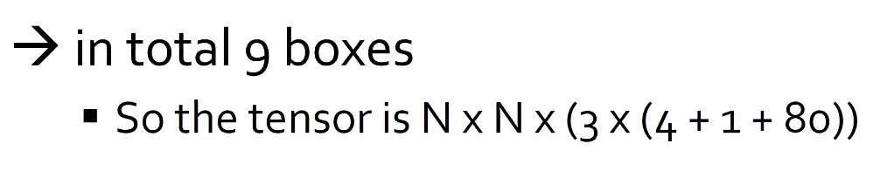
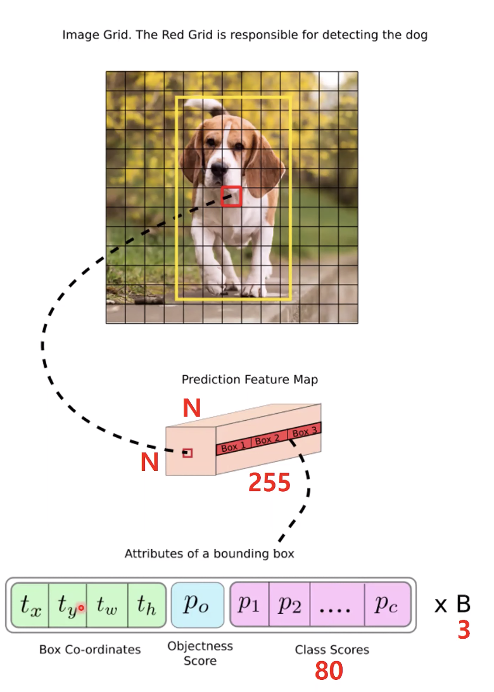
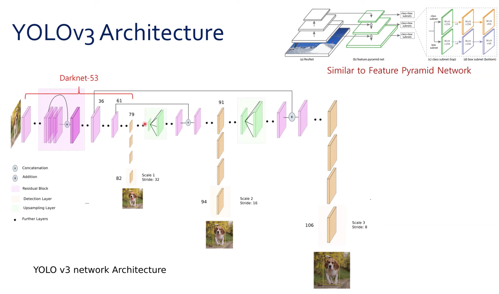
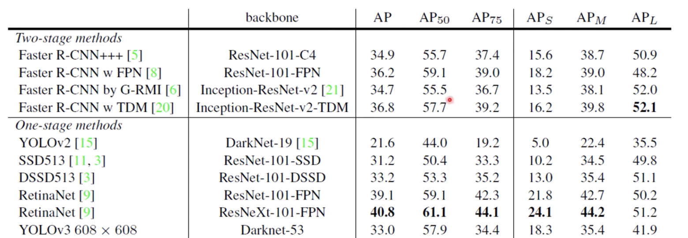

# YOLO v3

## Introduction

- Tech report
- Better, Not faster, Stronger ( 별로 빨라지지는 않았다, 모델 자체는 무거워졌기 때문에! 하지만 성능은 더 좋다)

### Bounding Box Prediction

- Anchor box 의 중심에 대한 prediction + width, height 에 대한 prediction ( regression problem )

- Objectness score ( logistic regression ) 를 각 bounding box 에 대하여 구할 수 있다

- bounding box 가 ground truth 를 어떠한 다른 bounding box prior 에 비해 overlap 한다면 obj score 는 무조건 1이 되어야 한다

- Faster RCNN 과 다르게 0.5 의 threshold 를 사용하는데 그 이유는 YOLO v3 는 각 ground truth object 에 대해 하나의 bounding box 를 할당한다.

  ** **여기서 bounding box prior 를 의미를 잘 모르겠다**

### Class prediction

- Performs multilabel classification

- Softmax 를 사용하는 것은 모든 class 들이 mutually exclusive 한 것을 가정한 것

  ( 예를 들면, person/women 을 구분하는 것은 두 class 의 위계가 존재하기 때문에, softmax 로 구분하는 것은 쉽지 않은 문제이다.)

- 따라서 모든 class prediction 을 softmax 하여 내는 것이 아니라, 각각의 class 별로 sigmoid 하여 confidence score 를 나타낸다. ( logistic regression 을 사용한다. )

### Predictions Across Scales

- **Three different scales** 로 **detection** 을 진행한다 ( 이 dataset 은 80개의 class 가 존재한다 )

- YOLO 만의 특징

  - **K-means Clustering** to determine bounding box priors

    - 9 clusters 와 3 scales를 임의로 잡아서 clustering 을 진행한다

      ( 예를 들어 사람을 인식한다고 생각하자, 사람은 보통 긴 bounding box 를 이루고 있기 때문에 clustering 을 통해 먼저 bounding box 의 사이즈를 잡아놓는 것이 성능상 좋다 )

    - 3개의 scale 을 고르고, 그 안에서 비율을 골라서 clustering 하나를 잡는다.

### YOLO v3 Architecture

- Similar to **Feature Pyramid Network**
  - 3 scales => 3개의 scale 을 가져와서 사용한다.
    - 가장 마지막 scale = Highest resolution => 가장 **작은** 물체를 찾는다
    - 가장 작은 scale = Smallest resolution => 가장 **큰** 물체를 찾는다

### Training

-  Negative sample imbalanced problems ( background 의 label 에 쳐져있는 box 의 수가 물체가 있는 곳의 box 보다 훨씬 많은 수이다 = 즉 negative sample 이 훨씬 많다 )

  - YOLO v3 에서는 이러한 hard negative mining 을 하지 않는 이유 ? 

    => threshold 보다 낮은 곳 , 즉 background 인 곳을 전부 버리기 때문에 negative sample 에 대한 imbalance 가 애초에 일어나지 않는다

### Results

- One stage or Two stage 계열의 detection network   에 비해 준수한 성능을 보인다.

  

- 큰 물체를 다른 것보다 잘 찾지 못했다.  

# Acknowledgement

본 논문 내용에 대한 정리는 PR-207 : YOLOv3 에 대한 내용을 정리한 것입니다. ( TFKR 논문 구현 스터디 )

https://www.youtube.com/watch?v=HMgcvgRrDcA