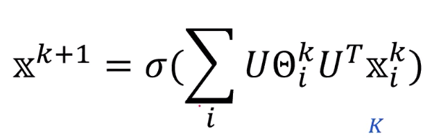
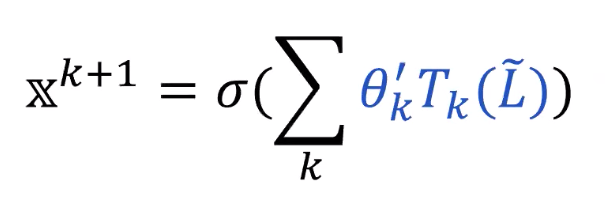

# Graph Convolutional Networks

Thomas N. Kipf, Max Welling

- 영상 속 presenter 는 추천하지는 않는다
- 

## GNN

Prerequisites

- Fourier Transform
- Eigen Decomposition
- Convolution Theorem

### Graph Review

1. Graph 와 image 는 다르다 => Image 는 영상 속에서 어떠한 space structure feature 를 갖는 반면에 **graph 는 각 데이터 사이의 관계에 의존한다**

### One-layer of GNN

#### Spectral CNN

- Graph data @ spectral domain => Cannot apply convolution

  **=> Fourier Transform + Convolution + Inverse Fourier Transform**

  **=> Non-linear passing**

#### Chebyshev Spectral CNN

- Approximate **spectral CNN** into simpler form

 