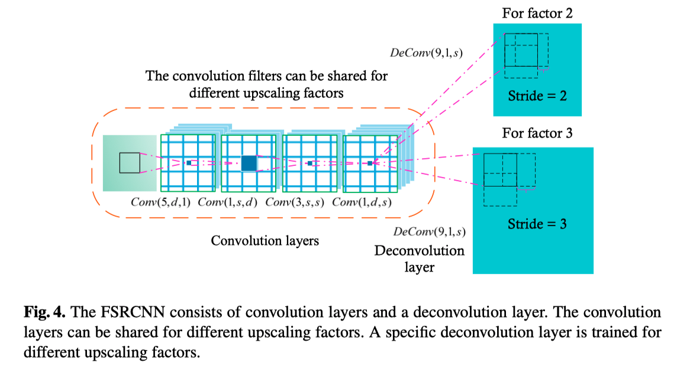

# Accelerating the Super-Resolution Convolutional Neural Network

> More Efficient network structure to achieve **high running speed** **without the loss of restoration quality**

## Abstract 

1. 이 연구의 목표는 SRCNN ( Super Resolution using Convolutional Neural Network ) 을 가속화 하는 것 

> propose a compact hourglass-shape CNN structure for faster and better SR

2. **Novelty** of this work
   1. **Deconvolution** at the end of the network == Mapping is learned directly from the original low-resolution image to high-resolution one
   2. **Reformulate** the mapping layer by shrinking the input feature before mapping and expanding back afterwards

## Network Structure

이 그림은 **FSRCNN 의 구조에 대해서 기존의 SRCNN 과 무엇이 다른지 보여준다**.

1. Deconvolution

   **FSRCNN** 은 **Deconvolution layer** 를 끝단에 추가하여 lr image 를 hr image 로 mapping 하는데 사용하고 있다. 기존 SRCNN 의 경우 input image 를 처음에 bicubic interpolation 을 사용하여 크기를 키운다. 이는 고전적인 interpolation 방식에 기반한다. 하지만 FSRCNN 의 경우에 deconvolution 의 parameter 도 학습이 이뤄지기 때문에 단순히 interpolation 을 진행하는 것보다 영상에 맞춰 Upscaling 이 된다는 장점이 있다.

2. Feature Extraction

   비교적 간단한 SRCNN 의 CNN layer ( Non-linear mapping step ) 를 크게 Shrinking, Mapping, Expanding의 3가지 step 으로 나누어 진행한다.

   #### Shrinking

   ##### SRCNN

   SRCNN 의 경우 feature extraction 이후 계산된 high-dimensional LR features 들이 HR feature space 에 직접적으로 mapping 된다. 하지만 보통 LR feature dimension 이 너무 크기때문에 mapping step 에서의 복잡도가 높다. 

   ##### FSRCNN

   그래서 이러한 복잡도를 낮춰 계산량을 줄이고자 1 x 1 convolution 을 사용하여 LR feature dimension d 를 줄인다. 

   > Fix the filter size to be 1, then the filters perform like a linear combination within the LR features.

   따라서 기존 LR feature dimension d 를 이것보다 더 작은 s 개 만큼의 필터 수를 적용하여 결국 d >> s dimension 이 적용된다.

   #### Non-Linear Mapping ( Most important part )

   Super Resolution 의 성능을 위해서 가장 중요한 부분이다. 구체적으로 가장 영향을 많이 주는 요소는 아래와 같다.

   > **width** ( i.e., the number of filters in a layer)
   >
   > **Depth** ( i.e., the number of layers )

   SRCNN 에 나와있는 것 처럼 5x5 layer 가 1x1 layer 보다 좋은 결과를 보여준다. 하지만 더 깊은 network 에서의 실험은 부족했다. 따라서 다음과 같은 사항을 고려했다.

   1. Medium filter size 3 x 3 : 성능과 network 의 크기의 trade-off 를 고려함
   2. Number of mapping layer : m

   여기서 모든 mapping layer 들은 모두 같은 수의 filter ( s ) 를 갖고 있다. 따라서 Non-Linear mapping part 는 

   > **m x Conv(3, s, s)**

   로 표현될 수 있다.

   #### Expanding

   Expanding layer 는 shrinking layer 의 반대로 진행된다고 보면 된다. Shrinking layer는 LR feature dimension 을 줄여 계산효율성을 높인다. 하지만, HR image 를 이러한 low-dimensional features 에서 직접적으로 생성해낼 경우에 마지막 영상의 퀄리티가 나쁠 것이다. 그래서 FSRCNN 에서는 mapping part 이후 expanding layer 를 추가하여 HR feature dimension 을 늘린다. 

   **일관성을 위해 LR feature dimension 을 줄이기 위해 사용했던 1x1 convolution 을 expanding 할 때에도 동일하게 사용하여 dimension 을 늘린다**. Shrinking layer 에서는 Conv(1, s, d) 였다면 Expanding layer 에서는 Conv(1, d, s) 이다. 실험한 결과, Expanding layer 가 없을 경우에 성능이 약 0.3 dB 까지 감소하는 것을 확인할 수 있었다. ( 아마 PSNR 기준 )

   #### Deconvolution

   마지막 layer 는 decovolution layer 이다. Deconvolution 은 convolution 의 반대 연산이라고 생각하면 된다. 

   여기서는 DeConv (9, 1, d) 를 사용하였다. ( filter size 9x9, d >> 1 dimension)

   

## From SRCNN to FSRCNN

#### SRCNN 을 가속하는 요소

3 가지 step 을 거쳐서 SRCNN-Ex 를 또 다른 FSRCNN 으로 변형

1. **Deconvolution Layer** (NO bicubic interpolation) at first

   input image 의 사이즈를 변형하지 않고 convolution layer 를 통과시키기 때문에 먼저 bicubic interpolation 을 하여 high res 로 만든 후에 convolution 계산을 하는 것과는 계산량이 확연히 다르다.

2. Single mapping layer => **combination of shrinking layer + 4 mapping layers + expanding layer**

   언뜻 보기에는 SRCNN 보다 깊어서 parameter 수가 많은 것 처럼 보이지만 58,976 => 17,088 로 약 3.5 배 감소하여 계산 효율이 올라갔다. ( 30.1 배 빨라짐 )

   또한 depth 가 성능에 지대한 영향을 미치는데 FSRCNN 에서는 SRCNN 에서의 하나의 wide layer 를 대체하기 위해 4개의 narrow layer 를 사용한다. **결과적으로 더 적은 parameter 수로 더 높은 성능을 보인다.**

## Result

