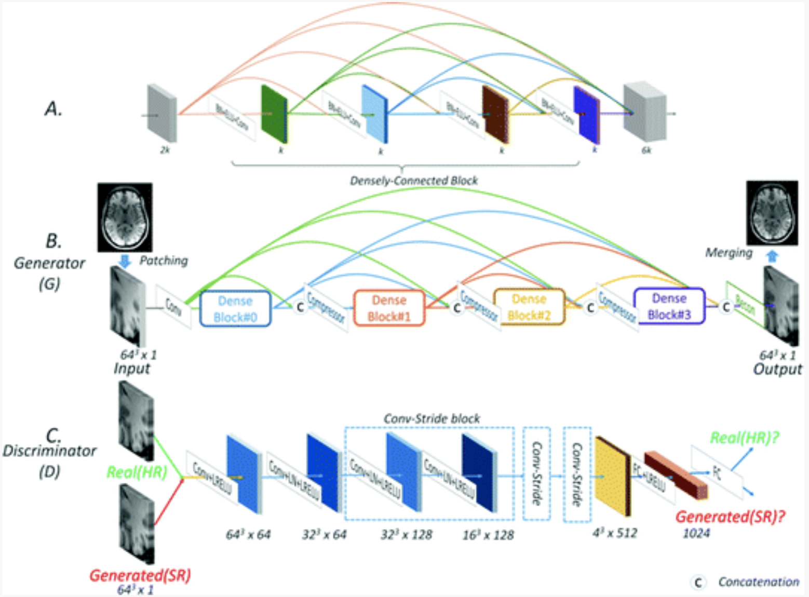

# Super Resolution Literature Survey

#### 1. Super-resolution MRI through Deep Learning (Qing Lyu et al, 2018 )

- Compared with polynomial interpolation or sparse-coding algorithms
- Two SOTA NN for CT denoting and deblurring, transfering them for super-resolution MRI
- Two-fold resolution enhancement

#### 2. CT Super-resolution GAN Constrained by the Identical, Residual, and Cycle Learning Ensemble(GAN-CIRCLE)

- Reference of [1]

#### 3. MRI Super-Resolution with Ensemble Learning and Complementary Priors ( Qing Lyu et al., 2019 )

- Obtaining high-quality MR image is often challenging
- Ensemble learning and DL framework for MR image Super Resolution
  - First **enlarged low resolution images** using 5 commonly used super-resolution algs and obtained differentiallly enlarged image datasets with complementary priors
  - Then, GAN is trained with each dataset to generate super-resolution MR images
  - Finally, **CNN is used for ensemble learning** that synergies **the outputs of GAN**s into the final MR SR images.
  - According to results, the ensemble learning results outcome any one of GAN outputs

#### 4. Efficient and Accurate MRI Super-Resolution Using a Generative Adversarial Network and 3D Multi-level Densely Connected Network ( Yuhua Chen, 2018, MICCAI )

- 3d NN design - multi-level densely connected super-resolution network (**mDCSRN**) with GAN

- The GAN promotes **realistic** output hardly distinguishable from original HR images

  

#### 5. Brain MRI super resolution using 3D deep densely connected neural networks ( Yuhua Chen et al., 2018, ISBI )

- **Single Image Super resolution (SISR)**
- 3D Densely Connected Super Resolution Network ( DCSRN )
- 4x resolution-reduced images | This model outperforms bicubic interpolation

#### 6. Enhanced generative adversarial network for 3D brain MRI super-resolution ( ***Jiancong Wang*** et al., 2020, WACV : winter conference on Applications of CV )

- **Single Image Super resolution (SISR) on 3D images**

- GAN framework and developed a generator coupled w/ discriminator to tackle the task of 3D SISR on T1 brain MRI images

- Developed a **3D memory-efficient residual-dense block generator ( MRDG )** that achieves SOTA performance in terms of PSNR, SSIM, NRMSE ( normalized MSE Error ) 

- **Pyramid pooling discriminator ( PPD )** to recover details on diff. size scales simultaneously

- Introduced a **model blending**, simple and computational efficient method **to balance btw image and texture quality** in the final output

  

#### 7. Image super-resolution using progressive generative adversarial networks for medical image analysis  ( Dwarikanath Mahaptra et al., 2018, Computerized Medical Imaging and Graphics )

- Proposed an image super-resolution method using progressive GAN ( P - GANs ) which takes an input a low resolution image and **generate a high resolution image of desired scaling factor**
- Primary Contribution : proposing **a multi-stage model** where the **output image quality of one stage** is **progressively improved in the next stage** by **using a triplet loss function**
- **Triplet loss** enables **stepwise image quality improvement** by **using the output of the previous stage as the baseline**
- Results show that this multi-stage **P-GAN outperforms competing methods and baseline GANs**.

#### 8. Multiscale brain MRI super-resolution using deep 3D convolutional networks  ( Chi-Hieu Pham et al., 2019, Computerized Medical Imaging and Graphics )

> #### **Highlights**
>
> - A residual-based deep 3D CNN architecture for super-resolution
> - Comprehensive performance analysis of key elements of NN
> - Multi-scale training approach to handle arbitrary scale factors
> - Multimodal CNN for super-resolution

- Relevance of several factors in the performance of the purely CNN-based techs for the monomodal super-resolution
- **One single network** can **efficiently handle multiple arbitrary scaling factors** based on a multiscale training approach
- Extend SR networks to the multimodal SR using **intermodality priors**
  - See how to get **intermodality priors**
- Investigate **the impact of transfer learning skills** onto super-resolution performance in terms of generalization among different datasets
- The **learnt models** are used to enhance real clinical low-resolution images

