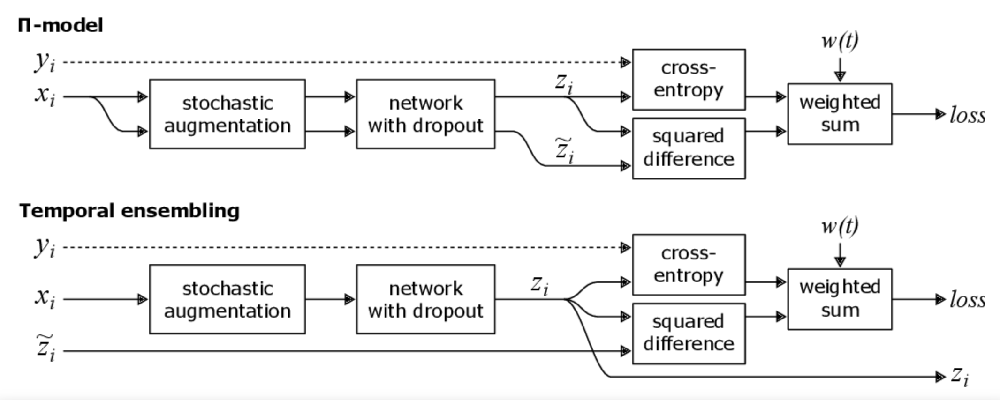
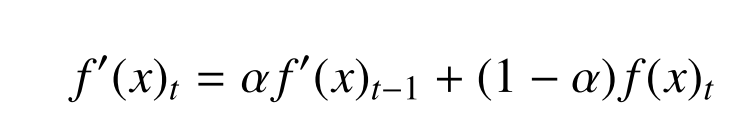
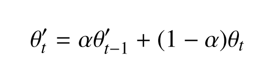
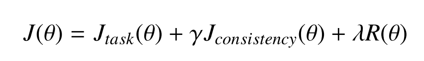

# Unsupervised domain adaptation for medical imaging segmentation with self-ensembling

## Abstract

1. When trained to reduce the empirical risk on a single domain, fail to generalize when applied to other domains
   1. In medical imaging
      1. variability of images & anatomical structures are **hard to generalize**
2. In this work
   1. Extend the method of **unsupervised DA using self-ensembling**
   2. Show that self-ensembling can improve the generalization of the models

## Introduction

1. The large amount of required data to train DNN => Partially mitigated with techniques such as transfer learning

   1. However, transfer learning is problematic in medical imaging **b.c a large dataset is still required**
   2. Medical images require careful and **time-consuming analysis from trained experts**

2. One of the most difficult to solve is the **so-called data distribution shift**

   1. Models trained under the **empirical risk minimization** ( ERM ) principle, might **fail to generalize** to other domains **due to its strong assumptions**
   2. ERM is good if its assumptions hold the fact **such as the fact that the training and test datasets derive from similar domains**

3. **Distribution Shift** is a problem in medical image analysis

   1. Over-optimistic evaluation results

4. The name given to learn a classifier model with a shift btw the training and the target distribution is called as "**domain adaptation**"

5. **Contributions**

   1. Extend **unsupervised DA** method using **self-ensembling**

   2. Ablation experiment to provide **strong evidence that unlabeled data is responsible** for the observed performance improvement

   3. Provide **visualizations** using t-SNE

      [*] **Unsupervised domain adaptation** (UDA) is the task of **training a statistical model on labeled data from a source domain to achieve better performance on data from a target domain, with access to only unlabeled data in the target domain**

      reference :  https://www.aclweb.org/anthology/N19-1039/ 

## Related work => Mean teacher Network 에 대해서 설명 !!!

1. **Deep Domain Adaptation (DDA)**
   1. Literatures
      1. Auto-encoders, GANs, Disentanglement strategies
      2. Higher-order statistics
      3. Explicit discrepancy btw source and target domain
      4. **Self-ensembling methods based on implicit discrepancy**
         1. Widely used for unsupervised domain adaptation
         2. Based on the **Mean Teacher network** ( = first introduced for semi-supervised learning task )
         3. Very few adjustments that need to be made to employ the method for the purpose of DDA

### Semi-supervised learning and unsupervised domain adaptation

1. Semi-supervised learning
   1. The assumption that the distribution of unlabeled data is similar to labeled data often fails in real-world applications
   2. **Domain shift** : the **difference** btw the distributions from the examples used in **training and test set**
2. **Unsupervised Domain adaptation**
   1. Only P(Xs), P(Y|Xs), P(Xt) is available ( No P(Y|Xt) )
   2. The task is **to leverage knowledge from the target domain using the unlabeled data available in P(Xt)** 

## Method

### Self-ensembling and mean teacher

1. Self-ensembling

   

   

   1. Π (pi)

      1. Employs a **consistency loss** btw predictions on the same input
         1. Each input from a batch is **passed twice through a NN**
         2. Each time with **distinct augmentation** parameters **to yield two diff. Predictions**
         3. **A squared diff.** btw those predictions is minimized along with the cross-entropy for the labeled examples

   2. Temporal Ensembling

      1. Works under the assumption that **as the training progresses, averaging the predictions over time on unlabeled samples** may contribute to a better approximation of the true labels

      2. The network performs **the EMA ( exponential moving average ) to update the generated targets** @ every epoch ( below figure is EMA )

         

   

2. Mean teacher

   1. Self-ensembling was extended to **directly combine model weights instead of predictions** => the Mean Teacher
   2. Updates the model weights at each step => generating a slightly improved model compared to the model w/o the EMA
   3. In this scenario, **EMA model was named teacher**, and **the standard model, student**

   

   - theta : model parameters

   - t : step

   - alpha : **hyperparameter regulating the importance of the current model's weights w.r.t previous models ( if alpha == 1 => same weight as previous step )** 

   - best result : alpha is increased later on during training

     ( Early Training step 에서의 parameter 를 뒤에 것 보다 더 많이 까먹는 방향으로 .. )

3. **Loss** for Mean teacher

   

   - **Gamma** : consistency weights ( empirically found )
   - **lambda** : regularization weights

   1. Loss for both labeled and unlabeled data
   2. All samples from a batch are **evaluated by both the student and teacher models**
      1. their **respective predictions compared via the consistency loss**
      2. labeled data is compared with ground truth ( task loss )

4. Mean Teacher framework uses 

   1. **teacher model to generate labels for unlabeled data**
   2. represents **a model of the same size** ( student model ) that is simultaneously updated during training

5. **Mean Teacher in UDA**

   1. French et al, 2017
      1. Modified the data batches s.t. each batch consists of images from both the source and target domains
   2. Procedure
      1. At each step, **student model evaluates images from the Xs and computes task loss based on labels**
      2. **target domain images** are used to compute the **consistency loss by comparing predictions** from both student and teacher
      3. The teacher model only has access to unlabeled examples
      4. Each loss function is responsible for improving at a single domain

### Adapting mean teacher for segmentation tasks

1. Task Loss : **Dice Loss** for segmentation task
   1. **Dice loss** was kept as the task loss for both baseline and adaptation experiments
   2. the dice loss is computed for the entire batch at once
2. Inconsistency btw training samples with spatial information
   1. Those augmentation parameters to both inputs are different
   2. To solve this, **spatial transformation** g(x;φ) is applied to both student and teacher models
   3. There is no need for differentiation on the delayed augmentation on the teacher model ( **Backprop only occurs for the student model** )

### Model Architecture

1. U-Net
   1. 15 layers
   2. **group normalization**
      1. NOT batch normalization
      2. Discussed later
   3. Dropout
2. Mean Teacher model
   1. Also acts as a **regularizer** ( kept the same regularization weights for all comparisons )

### Baseline employed

1. Hyperparameter Setting
   1. Minibatch size : 12
   2. dropout rate : 0.5
   3. Optimizer : Adam ( [0.99, 0.999])
   4. learning rate : **Sigmoid learning rate ramp-up** strategy until epoch 50 + **cosine ramp-down** until epoch 350
2. No hyperparameter from the baseline model was changed in the adaptation scenario

### Consistency loss - Important aspects of Mean Teacher

1. Student model - Teacher model loss
   1. Segmentation **relies on thresholding predictions from the teacher to define binary expected voxel values for the student**
   2. Focal loss, Dice loss, Tversky loss
      1. TV loss - Variation of Dice loss
      2. However **TV loss has many hyperparameters to determine**
   3. The output of teacher is soft ( not binary )
      1. Dice, TV loss are not proper to be applied
2. Alternative thresholding method to **modify the formulations of the loss functions s.t. they can properly handle non-binary labels**

### Batch Normalization and Group Normalization for domain adaptation

1. Batch Normalization
   1. stabilization of the distribution of layer inputs
   2. Smooth **the optimization landscape** of the network due to the **improvement of Lupschitzness or beta-smoothness**
   3. Problematic for DA w/ Mean Teacher
      1. multiple distributions being fed during training => Computing 2 distributions ! 
2. Group Normalization
   1. channels are divided into groups and mean, var are computed within each group regardless of batch sizes
   2. Works consistently better than BN w/ small batch size ( < 15)
   3. Simplifying the training and inference procedures providing better results

### Hyperparameters for unsupervised domain adaptation

1. In Unsupervised settings, there are no labeled data from tgt domain

   => hyperparameter settings are different btw source dist. and tgt dist.

2. Reverse cross validation

   1. increasing the complexity of the validation process
   2. However, it yields robust results/ so adopted this method

## Materials

1. Spinal Cord Gray Matter Challenge dataset
   1. **multi-center**
   2. **multi-vendor**
   3. Three different MRI systems - **Philips, Siemens Trio and Skyra**
   4. 80 control / 20 subjects per each center
   5. Labels
      1. 4 gold standard segmentation masks / manually created by 4 independent experts
   6. Dataset Split
      1. Training - center 1 & 2
      2. Validation - center 3
      3. Test - center 4

## Experiments

#### Adapting to different centers

1. Training with both center 1, 2
2. Then adapted the network to center 3 and 4 separately

#### Varying the consistency loss

1. Multiple runs of the Mean Teacher alg. by varying the consistency loss to determine which one works best
2. A thorough analysis of distinct loss should be performed for future works

#### Behavior of Dice loss and thresholding

1. Dice threshold : 0.9 ( not 0.99 )

#### Training stability

1. No annotations for validating the adaptation -> unstable training may produce sub-optimal adaptation results
2. Evaluation of training stability
   1. Tried many consisteny weights / and evaluated the differnece btw the best values
3. Results
   1. **Cross entropy** consistently fails - due to the class imbalance
   2. Dice & CE loss have trouble stabilizing the training after achieving high results
   3. **MSE tends to be more invariant to cosistency weight**

## Ablation studies

### Exponential moving average

## Domain shift visualization

1. t-SNE
   1. Vectors projected with t-SNE represents the features from the network prior to the final simoid activation

## Conclusion and limitations

1. Conclusion
   1. Showed that unsupervised DA, without depending on annotations, is an effective way to increase the performance of machine learning models
   2. Showed **how self-ensembling methods can improve generalization on unseen domains** through **the leverage of unlabeled data from multiple domains**
2. Limitation
   1. Didn't evaluate **adversarial training methods** for Domain adaptation
   2. Single-tast evaluation of the gray matter segmentation could be extended to other tasks

